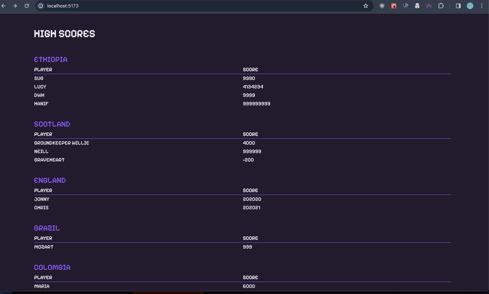

# High Score Tables

## Project Setup

This project uses [Vite](https://vitejs.dev/guide/), a modern build tool for React. To run the project, you will need to install the dependencies. In a terminal in the root of the project, run:

```zsh
npm install
```

Then you can start the development server:

```zsh
npm run dev
```

It will open a browser window at [http://localhost:5173/](http://localhost:5173/) and a test runner at [http://localhost:51205/**vitest**/#/](http://localhost:51205/__vitest__/#/).

# Challenge: "High Score Tables (React)"

## Challenge Overview

Make a React app which lists some high score tables. The scores data are provided for you.

## Difficulty Level

This is a beginner challenge. Level 1 can be completed simply by building the project and deploying it to Netlify. Explore the project to understand how to extend it to the higher levels.

You must complete at least levels 1 and 2 to pass this challenge.

## Pre-reqs

- react `props`
- `array.map` method as used in React JSX

### To finish level 4

- event handling (handle a button click)
- Keeping state with the state hook (`useState`)

### Example Screenshot

Level 1 challenge screenshot example.



# Level 1 Challenge

- Write a React app which displays high score tables for the given data.

- Each country must have its own High Score table displayed.
- Each table must show the country name and a list of players and their scores.
- There must be at least one unit test for each component.
- Your app must be hosted on Netlify (see "Hosting" below).

- Already made:
  - `HighScoreTable` - a table with a country name and a list of player-scores for that country.
  - `PlayerScore` - component responsible for displaying a single score by one player (e.g. as one line of the table) (e.g. `Neill 2000`)

### Getting Started

Make a new branch `feature/high-score-tables` and work in that branch for this project.

### The data:

The data is available in data/scores.json

## Hosting:

Fork this repo and host it on Netlify. You will need to deploy only this folder, not the whole repo, as you will deploy other projects from this same repo later.

Name your netlify site `cyf-YOURGITHUBUSERNAME-scores`

# Level 2

- Present the High Score Tables sorted alphabetically by country name

# Level 3

- Within each individual table, show the highest scores first - i.e. sort the scores numerically, descending.

# Level 4 - advanced (needs content from React week 2)

- Add a _single_ button at the top of the page which toggles the sort order of every high-score-table between ascending and descending by scores. This will require some study about event handlers and the use of a "State hook".

# Level 5 - advanced

- Add a "world-wide" table, shown first, which shows the sorted high scores from EVERYONE, regardless of country.

# Bonus

- Add your own country and scores!
- Add some old-skool videogame icons or animations
